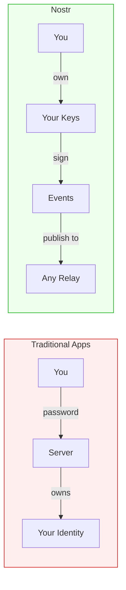
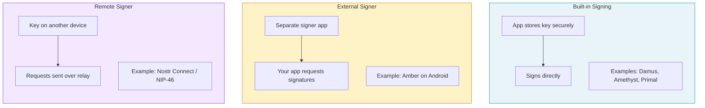
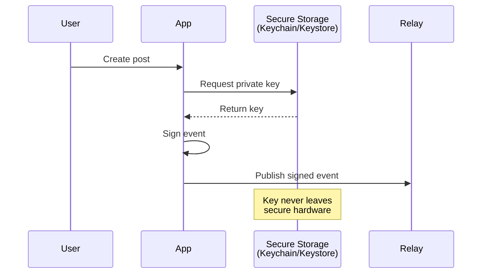
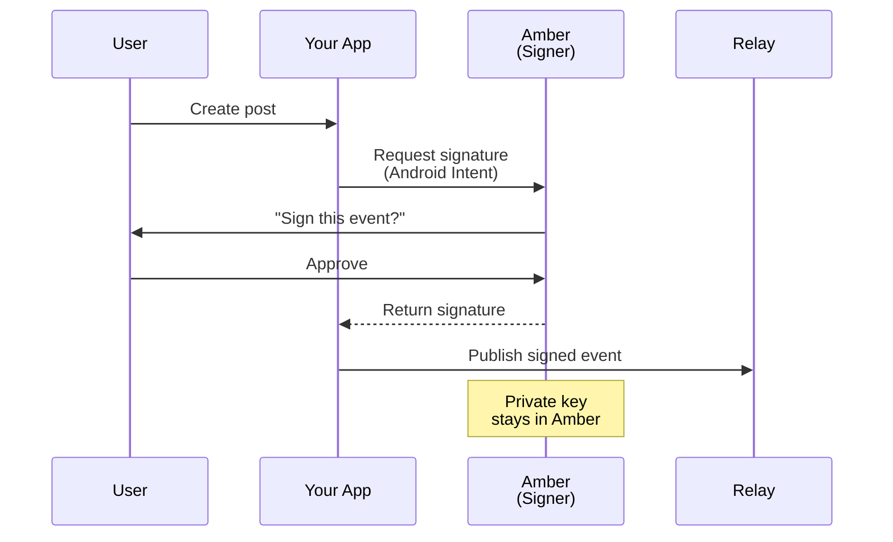
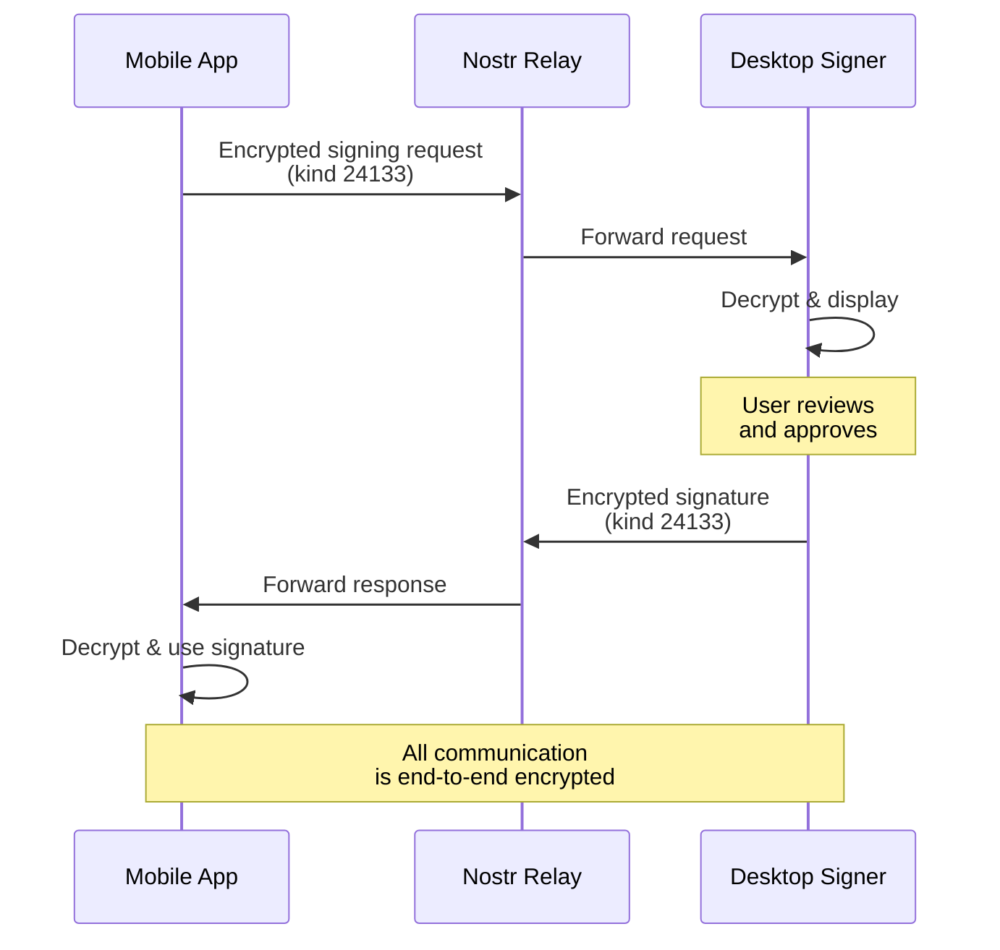
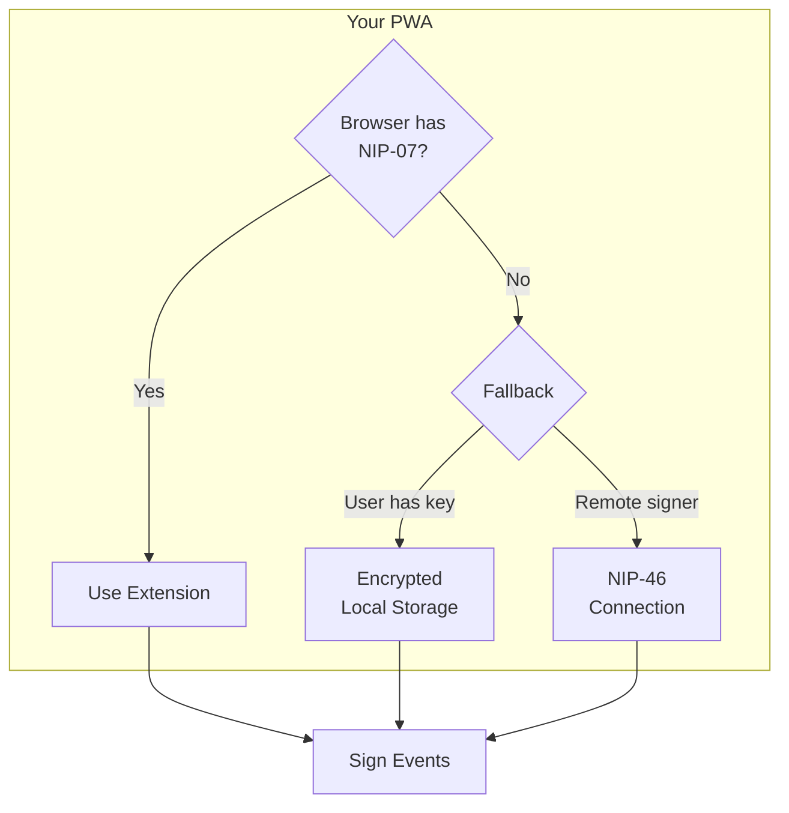
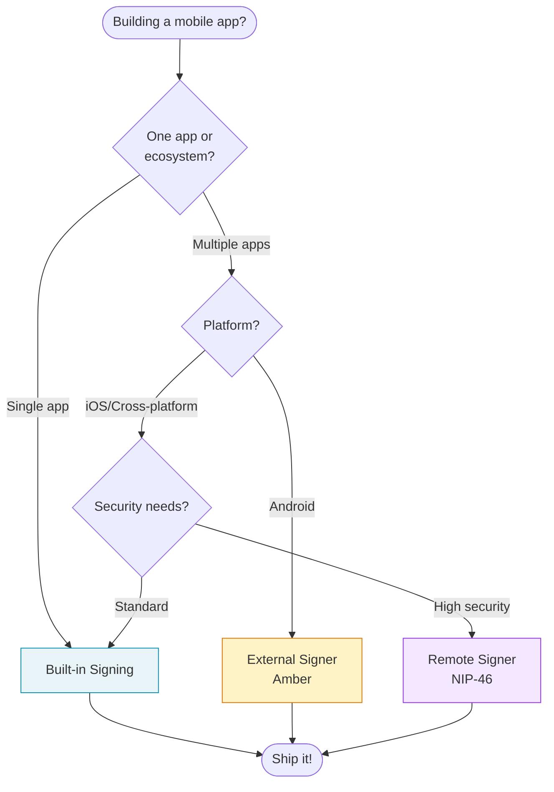
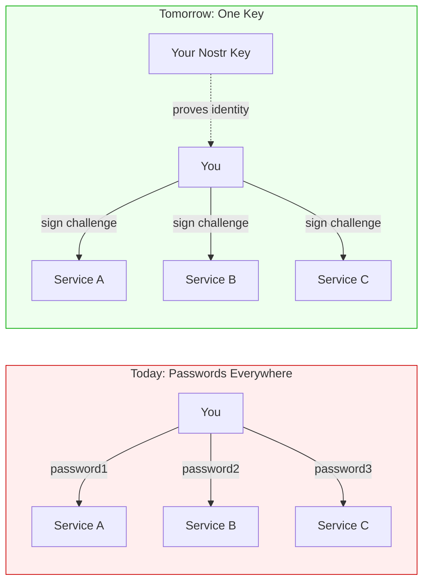

# Mobile Development

One of Nostr's most powerful features is that **your identity travels with you**. Unlike traditional apps where your account lives on a server, in Nostr your identity is just a cryptographic keypair. This means mobile apps don't need browser extensions. There are multiple ways to sign messages on any device.

## The Big Picture

In traditional apps, you authenticate to a server that holds your identity. In Nostr, **you are your keys**. The signing can happen anywhere.



## Three Ways to Sign on Mobile



| Approach | Best For | Trade-off |
|----------|----------|-----------|
| **Built-in** | Simplicity, offline use | Key tied to one app |
| **External Signer** | Multiple apps, one key | Android only (Amber) |
| **Remote Signer** | Maximum security | Requires network |

---

## Approach 1: Built-in Signing

Most popular Nostr apps store your private key securely on your device using platform security features.



### iOS: Using the Keychain

iOS apps use the Keychain, which can be backed by the Secure Enclave on modern iPhones.

```swift
import Security

class NostrKeyManager {
    private let service = "nostr-keys"

    func storePrivateKey(_ privateKey: Data, for pubkey: String) throws {
        let query: [String: Any] = [
            kSecClass as String: kSecClassGenericPassword,
            kSecAttrService as String: service,
            kSecAttrAccount as String: pubkey,
            kSecValueData as String: privateKey,
            // Only accessible when device is unlocked
            kSecAttrAccessible as String: kSecAttrAccessibleWhenUnlockedThisDeviceOnly
        ]

        let status = SecItemAdd(query as CFDictionary, nil)
        guard status == errSecSuccess else {
            throw KeychainError.unableToStore
        }
    }
}
```

**iOS Libraries:**
- [secp256k1.swift](https://github.com/GigaBitcoin/secp256k1.swift) - Schnorr signatures
- [NostrKit](https://github.com/nickkjordan/NostrKit) - Swift Nostr library

### Android: Using the Keystore

Android apps use the Keystore system, which provides hardware-backed key storage on supported devices.

```kotlin
import android.security.keystore.KeyGenParameterSpec
import android.security.keystore.KeyProperties
import javax.crypto.KeyGenerator

class NostrKeyManager(private val context: Context) {

    fun storePrivateKey(privateKeyHex: String, pubkey: String) {
        // Generate encryption key in hardware-backed keystore
        val keyGenerator = KeyGenerator.getInstance(
            KeyProperties.KEY_ALGORITHM_AES,
            "AndroidKeyStore"
        )
        keyGenerator.init(
            KeyGenParameterSpec.Builder(
                "nostr_$pubkey",
                KeyProperties.PURPOSE_ENCRYPT or KeyProperties.PURPOSE_DECRYPT
            )
            .setBlockModes(KeyProperties.BLOCK_MODE_GCM)
            .setEncryptionPaddings(KeyProperties.ENCRYPTION_PADDING_NONE)
            .build()
        )
        val secretKey = keyGenerator.generateKey()

        // Encrypt and store the Nostr private key
        // ... (see full example in repo)
    }
}
```

### Cross-Platform: React Native

```javascript
import * as Keychain from 'react-native-keychain';
import { schnorr } from '@noble/curves/secp256k1';

class NostrKeyManager {
  async storeKey(nsec, pubkey) {
    await Keychain.setGenericPassword(pubkey, nsec, {
      service: 'nostr-keys',
      accessible: Keychain.ACCESSIBLE.WHEN_UNLOCKED_THIS_DEVICE_ONLY
    });
  }

  async sign(eventHash, pubkey) {
    const credentials = await Keychain.getGenericPassword({
      service: 'nostr-keys'
    });
    if (!credentials) throw new Error('Key not found');

    const privateKey = hexToBytes(credentials.password);
    return bytesToHex(schnorr.sign(eventHash, privateKey));
  }
}
```

---

## Approach 2: External Signers

What if you want to use multiple Nostr apps but only manage your key in one place? External signers solve this.



### Amber (Android)

[Amber](https://github.com/greenart7c3/Amber) is the go-to external signer for Android. Users install Amber once, import their key, and any compatible app can request signatures.

```kotlin
// Request signature from Amber
fun requestSignature(event: UnsignedEvent) {
    val intent = Intent(Intent.ACTION_VIEW).apply {
        data = Uri.parse("nostrsigner:${event.toJson()}")
        putExtra("type", "sign_event")
        putExtra("returnType", "signature")
    }
    startActivityForResult(intent, SIGN_REQUEST_CODE)
}

// Handle response
override fun onActivityResult(requestCode: Int, resultCode: Int, data: Intent?) {
    if (requestCode == SIGN_REQUEST_CODE && resultCode == RESULT_OK) {
        val signature = data?.getStringExtra("signature")
        // Attach signature to event and publish
    }
}
```

**Why use an external signer?**
- One key, many apps
- User sees exactly what they're signing
- Easy to revoke access (just uninstall the requesting app)
- Follows the principle of least privilege

---

## Approach 3: Remote Signing (NIP-46)

For maximum security, your private key can live on a completely separate device. Signing requests are sent encrypted over Nostr relays.



### How It Works

1. **Setup**: You run a signer (like nsecBunker) on a secure device
2. **Connect**: Your mobile app connects via a `bunker://` URL
3. **Sign**: When you need to sign, the request goes through relays
4. **Approve**: You approve on your secure device

```javascript
// Connecting to a remote signer
const bunkerUrl = 'bunker://signer-pubkey?relay=wss://relay.example.com&secret=xyz';

class RemoteSigner {
  async connect(bunkerUrl) {
    const parsed = parseBunkerUrl(bunkerUrl);
    this.signerPubkey = parsed.pubkey;
    this.relays = parsed.relays;

    // Generate session keypair
    this.sessionKey = generateSecretKey();

    // Send connect request (encrypted)
    await this.sendRequest('connect', [getPublicKey(this.sessionKey)]);
  }

  async signEvent(event) {
    // Request goes to signer via relay
    return await this.sendRequest('sign_event', [JSON.stringify(event)]);
  }
}
```

### When to Use Remote Signing

- High-value identities (influencers, businesses)
- Shared team accounts with approval workflows
- Maximum security requirements
- When you want signing logs and audit trails

---

## Progressive Web Apps (PWAs)

Web apps work on any mobile browser. They can use local key storage or connect to remote signers.



### Browser Extension Support on Mobile

Some mobile browsers support extensions:
- **Firefox Android**: Supports nos2x and other signing extensions
- **Kiwi Browser**: Chrome extension support on Android
- **Orion**: Safari extension support on iOS

For browsers without extension support, use local encrypted storage or NIP-46.

---

## Choosing the Right Approach



---

## HTTP Schnorr Authentication

The W3C Nostr Community Group is developing [HTTP Authentication Using Schnorr Signatures](https://nostrcg.github.io/http-schnorr-auth/). This brings Nostr's signing capabilities to standard HTTP authentication.

### What This Enables



**Use cases:**
- **Single Sign-On**: One Nostr identity across all services
- **Pod Migration**: Sign a statement to move your data between servers
- **API Authentication**: Sign HTTP requests with your Nostr key

### Example: Authorizing a Data Migration

A user can sign a statement like "move my data from server A to server B" and any compliant server can verify it. No DNS changes or domain ownership required.

```javascript
// Sign a migration authorization
const migrationEvent = {
  kind: 30078,  // Application-specific data
  content: JSON.stringify({
    action: 'migrate',
    from: 'https://old-pod.example.com',
    to: 'https://new-pod.example.com'
  }),
  tags: [['d', 'migration-auth']],
  created_at: Math.floor(Date.now() / 1000)
};

const signed = await signer.signEvent(migrationEvent);
// New server verifies: signature valid + pubkey matches account
```

The cryptographic signature is the proof of authorization. Works on any device, any platform.

---

## Real-World Examples

| App | Platform | Signing Approach | Source |
|-----|----------|-----------------|--------|
| **Damus** | iOS | Built-in (Keychain) | [GitHub](https://github.com/damus-io/damus) |
| **Amethyst** | Android | Built-in + Amber | [GitHub](https://github.com/vitorpamplona/amethyst) |
| **Primal** | iOS/Android/Web | Built-in | [primal.net](https://primal.net) |
| **Snort** | Web/PWA | NIP-07 + Local | [GitHub](https://github.com/v0l/snort) |

---

## Key Takeaways

:::tip The "Aha!" Moments

1. **Your identity is portable**. Unlike accounts on servers, your Nostr keypair works everywhere.

2. **Signing and apps are separate**. Any app can request signatures from any signer.

3. **Mobile doesn't need browser extensions**. Native apps, external signers, and remote signers all work.

4. **The signature is the proof**. Whether migrating data or logging in, a cryptographic signature proves you authorized it.

:::

## See Also

- [Key Management](./key-management) - Security best practices
- [Building Clients](./building-clients) - Client architecture patterns
- [NIP-07](https://github.com/nostr-protocol/nips/blob/master/07.md) - Browser extension interface
- [NIP-46](https://github.com/nostr-protocol/nips/blob/master/46.md) - Remote signing protocol
- [NIP-55](https://github.com/nostr-protocol/nips/blob/master/55.md) - Android signer interface
- [HTTP Schnorr Auth](https://github.com/nostrcg/http-schnorr-auth) - W3C Nostr CG work item
